<picture>
  <source media="(prefers-color-scheme: dark)" srcset="./assets/banner-dark.svg">
  <source media="(prefers-color-scheme: light)" srcset="./assets/banner-light.svg">
  
</picture>

  
  
  

## Hi, I'm Imrane 👋

Software engineer from Casablanca, graduated from **EMSI** (Computer Science & Networks). I build
full-stack products end to end — from the first spec to production — with **React, Node.js and
Google Cloud**.

My final-year project, **Tunneleads**, is a multi-tenant SaaS that pulls sales calls from a company's
phone system, transcribes them, and scores them with AI. Calls switch between Darija and French
mid-sentence, so I benchmarked several models on real recordings before choosing one.

<table>
  <tr>
    <td>🔭 Developing <b>Tunneleads</b> after defending it in September 2026</td>
  </tr>
  <tr>
    <td>☁️ Oracle Cloud Infrastructure 2025 certified — DevOps Professional · Data Science Professional</td>
  </tr>
  <tr>
    <td>💬 Arabic · French · English</td>
  </tr>
</table>

## Featured work

<table>
  <tr>
    <td width="50%" valign="top">
      <h3>🎙️ Tunneleads</h3>
      Final-year project at Qualeads · 2026
      
Multi-tenant SaaS that turns sales calls into coaching: recordings are fetched from the
      company's PBX, linked to the right lead, transcribed and analyzed by Gemini (summary, score,
      objections, next steps), then shown in a manager dashboard.

      <ul>
        <li>Database per tenant, RBAC, MFA, append-only audit log</li>
        <li>On-premise connector in <b>Go</b> over mutual TLS — no inbound ports</li>
        <li>124 test files, 800+ automated cases, validated on a real FreePBX/Asterisk pilot</li>
      </ul>
      

        
        
        
        
        
        
      

      🔒 Private repository — walkthrough available on request
    </td>
    <td width="50%" valign="top">
      <h3>🔗 <a href="https://github.com/ADLI-Imrane/wrx-generator-v2">WRX Generator v2</a></h3>
      Personal project · 2025–2026 · <a href="https://wrx.link">wrx.link</a>
      
A URL shortener and custom QR-code platform rebuilt as a monorepo, shipped on the web,
      mobile and as a Chrome extension, with integrated payments.

      <ul>
        <li>pnpm workspaces monorepo with shared packages</li>
        <li>Stripe payments and Supabase auth/data</li>
        <li>Live in production</li>
      </ul>
      

        
        
        
        
        
      

    </td>
  </tr>
  <tr>
    <td width="50%" valign="top">
      <h3>🏥 HR Information System</h3>
      Internship at Omnidoc Santé · 2025
      
Co-developed a full-stack HRIS used in production for employee records, leave requests and
      payroll. Modeled in UML and hosted on Microsoft Azure.

      

        
        
        
        
      

      🔒 Company-owned code
    </td>
    <td width="50%" valign="top">
      <h3>🛍️ Shopify AI Studio</h3>
      Personal project · 2026
      
Automates e-commerce product photography with Vertex AI, plus an SEO tool that optimizes
      Shopify products and collections.

      

        
        
        
      

      🔒 Private repository
    </td>
  </tr>
</table>

## Tech stack

   
   
   
  

**Also:** Gemini & Vertex AI · FreePBX / Asterisk · SIP · Shopify · UML · Scrum

## Experience

| Period | Role | Company |
| :-- | :-- | :-- |
| Feb 2026 – now | Full-Stack Software Engineer (final-year project) | Qualeads |
| Jul – Sep 2025 | Web Developer Intern | Omnidoc Santé |
| Jul – Sep 2024 | Web Developer Intern | Qualeads |
| Jul – Sep 2022 | Web Developer Intern | Declic Agency |

  Looking for a full-stack role in Casablanca — happy to walk you through any of these projects. 
  <a href="mailto:imrane.adli.pro@gmail.com"><b>imrane.adli.pro@gmail.com</b></a>

